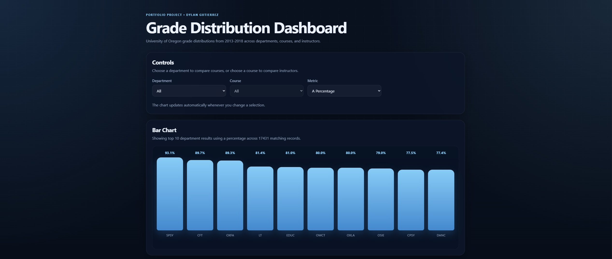
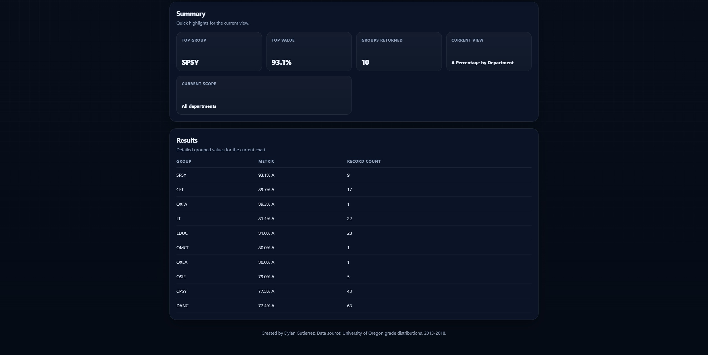

# Grade Distribution Dashboard

A full-stack academic data visualization project built with a custom Java database engine, a Spring Boot backend, and a vanilla JavaScript frontend.

This dashboard lets users explore **University of Oregon grade distributions from 2013–2018** across departments, courses, and instructors.

## Overview

This project was built to demonstrate:

- custom database and storage logic in Java
- backend API development with Spring Boot
- frontend interaction and visualization with vanilla JavaScript
- end-to-end integration between a Java backend and a JavaScript frontend

The application supports a hierarchical browsing flow:

- **All Departments** → compares departments
- **Selected Department** → compares courses within that department
- **Selected Course** → compares instructors who taught that course

Users can view:

- **A Percentage**
- **D/F Percentage**

## Features

- Interactive bar chart visualization
- Department → Course → Instructor drill-down UI
- Automatic updates when selections change
- Top-result limiting for readable charts
- Record-count thresholds to avoid misleading rankings
- Read-only dataset bootstrapped from CSV at startup if on-disk data is missing
- Startup cache warmup for faster dashboard responses after launch

## Tech Stack

- **Java**
- **Spring Boot**
- **Vanilla JavaScript**
- **HTML / CSS**
- **Maven**

## Dataset

- **Source:** University of Oregon
- **Coverage:** 2013–2018
- **Input file:** `src/main/resources/data.csv`

The application treats the dataset as read-only for this demo.

## Running Locally

### Requirements

- Java 21+
- Maven

### Start the application

Inside java-db:

```bash
mvn spring-boot:run
```

Then open:

```text
http://localhost:8080/
```

### Startup Behavior

On startup, the application:
1. checks whether the processed dataset already exists
2. rebuilds it from data.csv if needed
3. warms the in-memory cache
4. starts serving requests

## Project Structure

```text
src/
├─ main/
│  ├─ java/com/dylangutierrez/lstore/
│  │  ├─ JavaDbApplication.java
│  │  ├─ AppStartupInitializer.java
│  │  ├─ GradesDistributionController.java
│  │  ├─ CoursesDataService.java
│  │  ├─ Database.java
│  │  ├─ Table.java
│  │  ├─ Query.java
│  │  └─ ...
│  └─ resources/
│     ├─ static/
│     │  ├─ index.html
│     │  ├─ css/styles.css
│     │  └─ js/app.js
│     └─ data.csv
pom.xml
```

## Screenshots





## Live Demo

[View the deployed app](https://gradesdashboard-dylangutierrez.up.railway.app/)

Railway notes:

- Railway will set free-user projects, like mine, to offline after a period of time. I can redeploy if needed.
- Railway has a limited amount of memory available for free-users. Too many people using the web app at the same time will cause a memory shortage and all users will be unable to request new graphs.

## Why This Project Exists

I built this project to showcase both backend and frontend ability in one deployable Java application:

- designing and implementing a custom Java database system
- exposing that data through a Java API
- building a usable frontend that consumes the API and visualizes the results

## Author

Dylan Gutierrez